# Data Product Analytics Platform - Complete Guide

A comprehensive guide to understanding the Data Product Analytics Platform, its architecture, and how all the pieces work together.

**Live Demo:** https://data-product-analytics.vercel.app

---

## Table of Contents

1. [What is this Project?](#what-is-this-project)
2. [Architecture Overview](#architecture-overview)
3. [Deployment Modes](#deployment-modes)
4. [System Components](#system-components)
5. [Data Flow](#data-flow)
6. [Key Features Explained](#key-features-explained)
7. [Technology Stack](#technology-stack)
8. [How the AI Chat Works](#how-the-ai-chat-works)
9. [Database Schema](#database-schema)
10. [API Reference](#api-reference)
11. [Setup Guide](#setup-guide)
12. [Troubleshooting](#troubleshooting)

---

## What is this Project?

This platform helps organizations track how their internal **data products** (dashboards, reports, datasets, analytics tools) are being used. Think of it as "Google Analytics" but for your internal data tools.

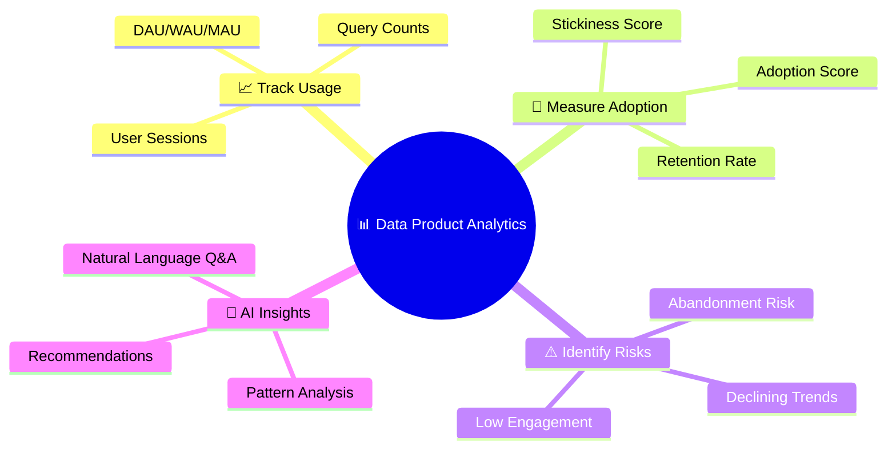
```mermaid
mindmap
  root((📊 Data Product Analytics))
    📈 Track Usage
      DAU/WAU/MAU
      Query Counts
      User Sessions
    🎯 Measure Adoption
      Adoption Score
      Stickiness Score
      Retention Rate
    ⚠️ Identify Risks
      Abandonment Risk
      Declining Trends
      Low Engagement
    🤖 AI Insights
      Recommendations
      Pattern Analysis
      Natural Language Q&A
```

### Problems it Solves

| Problem | Solution |
|---------|----------|
| "Is anyone using our new dashboard?" | Track Daily/Weekly/Monthly Active Users |
| "Which reports are dying?" | Abandonment risk scoring |
| "What should we improve?" | AI-powered recommendations |
| "Who are our power users?" | User behavior analytics |

### Key Metrics Tracked

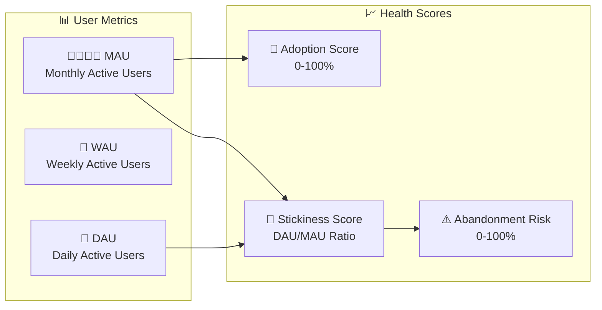
```mermaid
graph LR
    subgraph "📊 User Metrics"
        DAU["👤 DAU<br/>Daily Active Users"]
        WAU["👥 WAU<br/>Weekly Active Users"]
        MAU["👨‍👩‍👧‍👦 MAU<br/>Monthly Active Users"]
    end

    subgraph "📈 Health Scores"
        AS["🎯 Adoption Score<br/>0-100%"]
        SS["🔄 Stickiness Score<br/>DAU/MAU Ratio"]
        AR["⚠️ Abandonment Risk<br/>0-100%"]
    end

    DAU --> SS
    MAU --> AS
    MAU --> SS
    SS --> AR
```

---

## Architecture Overview

### High-Level System Architecture

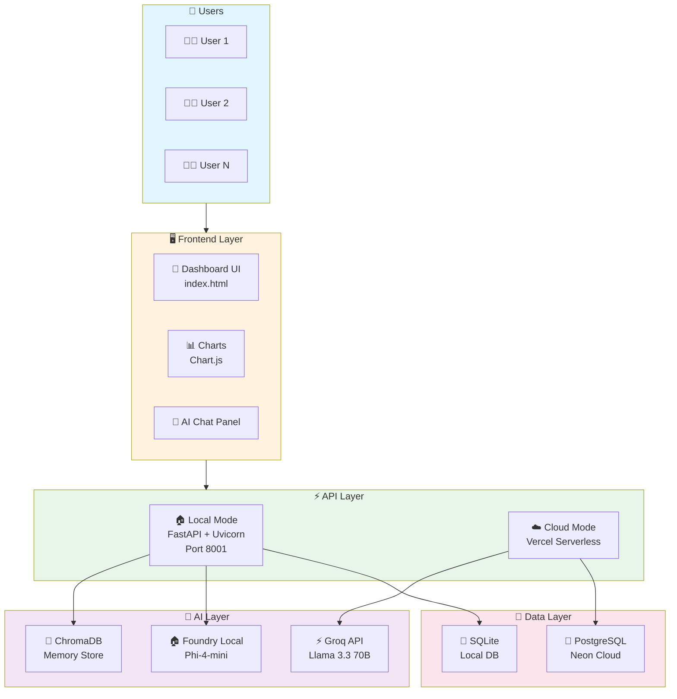
```mermaid
flowchart TB
    subgraph Users["👥 Users"]
        U1["🧑‍💻 User 1"]
        U2["🧑‍💻 User 2"]
        U3["🧑‍💻 User N"]
    end

    subgraph Frontend["🖥️ Frontend Layer"]
        UI["📱 Dashboard UI<br/>index.html"]
        Charts["📊 Charts<br/>Chart.js"]
        Chat["💬 AI Chat Panel"]
    end

    subgraph API["⚡ API Layer"]
        direction LR
        Local["🏠 Local Mode<br/>FastAPI + Uvicorn<br/>Port 8001"]
        Cloud["☁️ Cloud Mode<br/>Vercel Serverless"]
    end

    subgraph Data["💾 Data Layer"]
        direction TB
        SQLite["📁 SQLite<br/>Local DB"]
        Postgres["🐘 PostgreSQL<br/>Neon Cloud"]
    end

    subgraph AI["🤖 AI Layer"]
        direction TB
        Foundry["🏠 Foundry Local<br/>Phi-4-mini"]
        Groq["⚡ Groq API<br/>Llama 3.3 70B"]
        ChromaDB["🧠 ChromaDB<br/>Memory Store"]
    end

    Users --> Frontend
    Frontend --> API
    Local --> SQLite
    Local --> Foundry
    Local --> ChromaDB
    Cloud --> Postgres
    Cloud --> Groq

    style Users fill:#e1f5fe
    style Frontend fill:#fff3e0
    style API fill:#e8f5e9
    style Data fill:#fce4ec
    style AI fill:#f3e5f5
```

### Request Flow

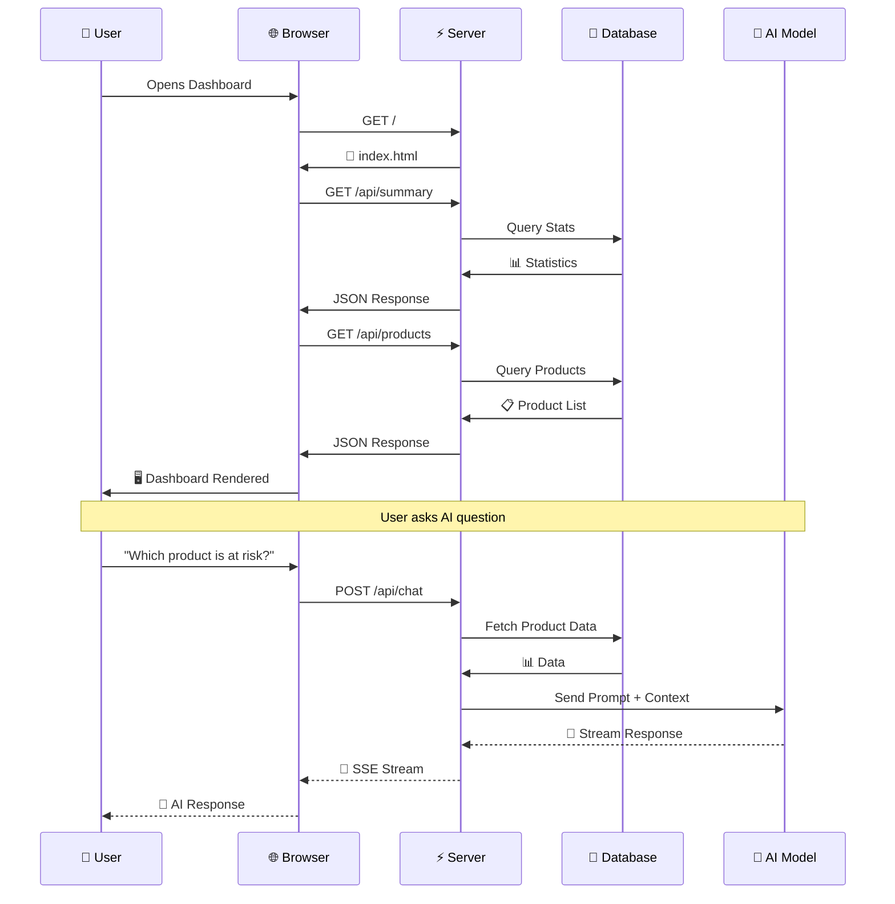
```mermaid
sequenceDiagram
    participant U as 👤 User
    participant B as 🌐 Browser
    participant S as ⚡ Server
    participant D as 💾 Database
    participant A as 🤖 AI Model

    U->>B: Opens Dashboard
    B->>S: GET /
    S->>B: 📄 index.html

    B->>S: GET /api/summary
    S->>D: Query Stats
    D->>S: 📊 Statistics
    S->>B: JSON Response

    B->>S: GET /api/products
    S->>D: Query Products
    D->>S: 📋 Product List
    S->>B: JSON Response

    B->>U: 🖥️ Dashboard Rendered

    Note over U,A: User asks AI question

    U->>B: "Which product is at risk?"
    B->>S: POST /api/chat
    S->>D: Fetch Product Data
    D->>S: 📊 Data
    S->>A: Send Prompt + Context
    A-->>S: 🔄 Stream Response
    S-->>B: 🔄 SSE Stream
    B-->>U: 💬 AI Response
```

---

## Deployment Modes

This application supports two deployment modes:

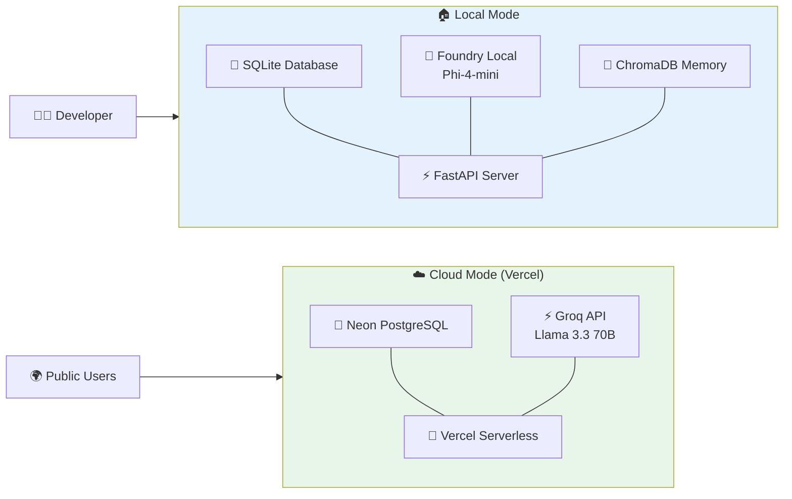
```mermaid
flowchart LR
    subgraph Local["🏠 Local Mode"]
        direction TB
        L1["💾 SQLite Database"]
        L2["🤖 Foundry Local<br/>Phi-4-mini"]
        L3["🧠 ChromaDB Memory"]
        L4["⚡ FastAPI Server"]
        L1 --- L4
        L2 --- L4
        L3 --- L4
    end

    subgraph Cloud["☁️ Cloud Mode (Vercel)"]
        direction TB
        C1["🐘 Neon PostgreSQL"]
        C2["⚡ Groq API<br/>Llama 3.3 70B"]
        C3["🚀 Vercel Serverless"]
        C1 --- C3
        C2 --- C3
    end

    Dev["🧑‍💻 Developer"] --> Local
    Public["🌍 Public Users"] --> Cloud

    style Local fill:#e3f2fd
    style Cloud fill:#e8f5e9
```

### Local Mode (Development)

Best for development and testing on your machine.

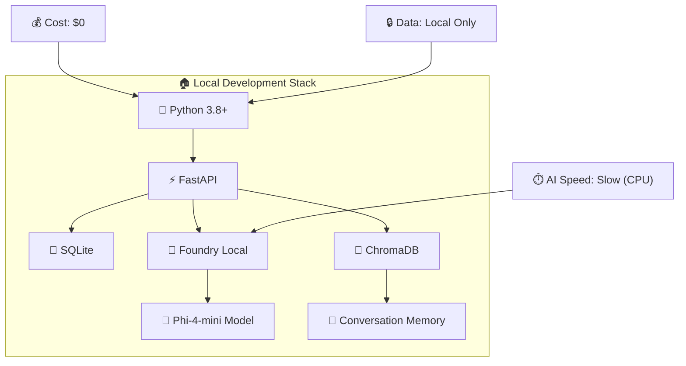
```mermaid
graph TD
    subgraph "🏠 Local Development Stack"
        A["🐍 Python 3.8+"] --> B["⚡ FastAPI"]
        B --> C["📁 SQLite"]
        B --> D["🤖 Foundry Local"]
        D --> E["🧠 Phi-4-mini Model"]
        B --> F["💾 ChromaDB"]
        F --> G["📝 Conversation Memory"]
    end

    H["💰 Cost: $0"] --> A
    I["🔒 Data: Local Only"] --> A
    J["⏱️ AI Speed: Slow (CPU)"] --> D
```

### Cloud Mode (Vercel)

Best for sharing and production use.

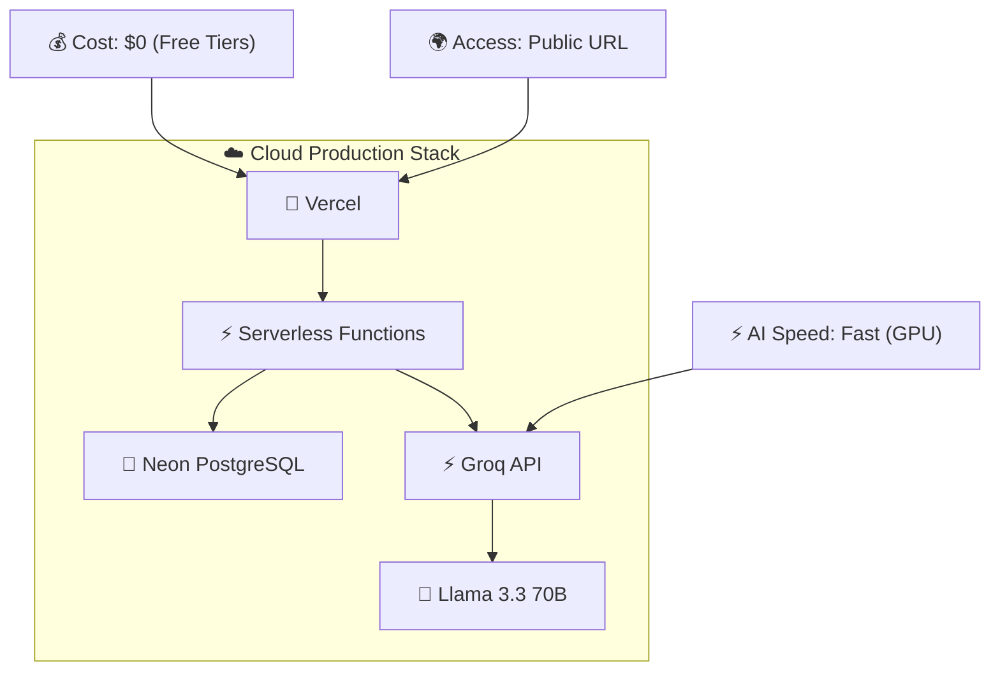
```mermaid
graph TD
    subgraph "☁️ Cloud Production Stack"
        A["🚀 Vercel"] --> B["⚡ Serverless Functions"]
        B --> C["🐘 Neon PostgreSQL"]
        B --> D["⚡ Groq API"]
        D --> E["🦙 Llama 3.3 70B"]
    end

    F["💰 Cost: $0 (Free Tiers)"] --> A
    G["🌍 Access: Public URL"] --> A
    H["⚡ AI Speed: Fast (GPU)"] --> D
```

### Comparison Table

| Feature | 🏠 Local Mode | ☁️ Cloud Mode (Vercel) |
|---------|------------|---------------------|
| **URL** | http://localhost:8001 | https://data-product-analytics.vercel.app |
| **Database** | 📁 SQLite | 🐘 Neon PostgreSQL |
| **AI Provider** | 🤖 Foundry Local (Phi-4-mini) | ⚡ Groq (Llama 3.3 70B) |
| **AI Speed** | 🐢 Slow (CPU) | 🚀 Fast (cloud GPU) |
| **Memory** | ✅ Yes (ChromaDB) | ❌ No |
| **Setup** | 🔧 Required | ✨ One-click |
| **Cost** | 💰 $0 | 💰 $0 |
| **Sharing** | 🔒 Local only | 🌍 Public URL |

---

## System Components

### Component Overview

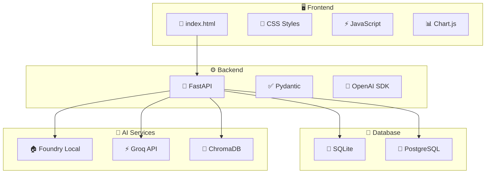
```mermaid
graph TB
    subgraph "🖥️ Frontend"
        HTML["📄 index.html"]
        CSS["🎨 CSS Styles"]
        JS["⚡ JavaScript"]
        ChartJS["📊 Chart.js"]
    end

    subgraph "⚙️ Backend"
        FastAPI["🐍 FastAPI"]
        Pydantic["✅ Pydantic"]
        OpenAI["🔌 OpenAI SDK"]
    end

    subgraph "💾 Database"
        SQLite["📁 SQLite"]
        Postgres["🐘 PostgreSQL"]
    end

    subgraph "🤖 AI Services"
        Foundry["🏠 Foundry Local"]
        Groq["⚡ Groq API"]
        Chroma["🧠 ChromaDB"]
    end

    HTML --> FastAPI
    FastAPI --> SQLite
    FastAPI --> Postgres
    FastAPI --> Foundry
    FastAPI --> Groq
    FastAPI --> Chroma
```

### 1. Frontend (User Interface)

**File:** `static/index.html`

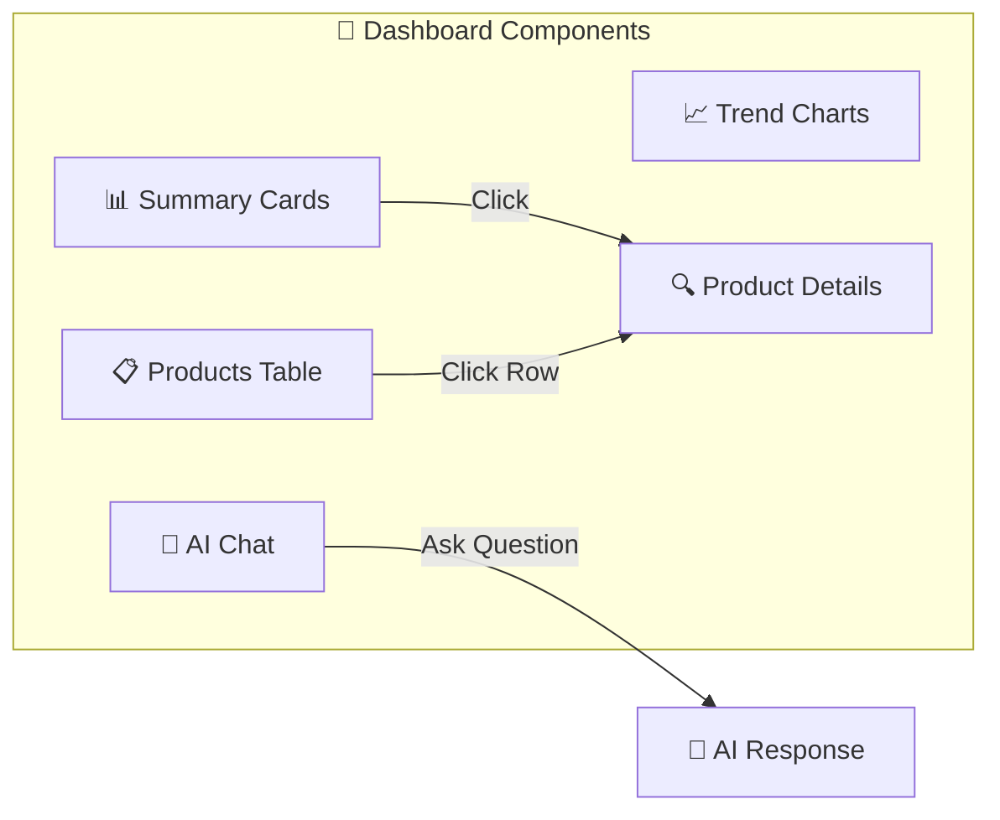
```mermaid
graph LR
    subgraph "📱 Dashboard Components"
        A["📊 Summary Cards"]
        B["📋 Products Table"]
        C["📈 Trend Charts"]
        D["💬 AI Chat"]
        E["🔍 Product Details"]
    end

    A --> |Click| E
    B --> |Click Row| E
    D --> |Ask Question| F["🤖 AI Response"]
```

**Key UI Components:**
- **📊 Summary Cards** - Quick metrics overview
- **📋 Products Table** - Clickable rows for detailed view
- **📈 Charts** - Visual trends using Chart.js
- **💬 AI Chat** - Floating chat button (bottom-right)

---

### 2. Backend API

**Local:** `app.py` | **Cloud:** `api/index.py`

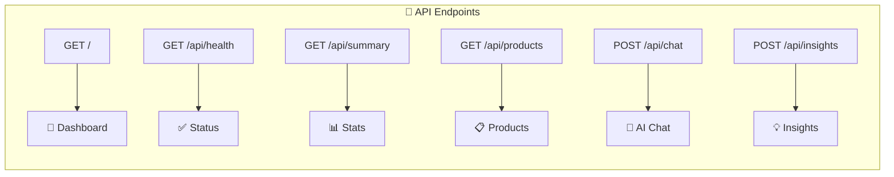
```mermaid
graph LR
    subgraph "🔌 API Endpoints"
        A["GET /"] --> A1["📄 Dashboard"]
        B["GET /api/health"] --> B1["✅ Status"]
        C["GET /api/summary"] --> C1["📊 Stats"]
        D["GET /api/products"] --> D1["📋 Products"]
        E["POST /api/chat"] --> E1["💬 AI Chat"]
        F["POST /api/insights"] --> F1["💡 Insights"]
    end
```

---

### 3. Database Layer

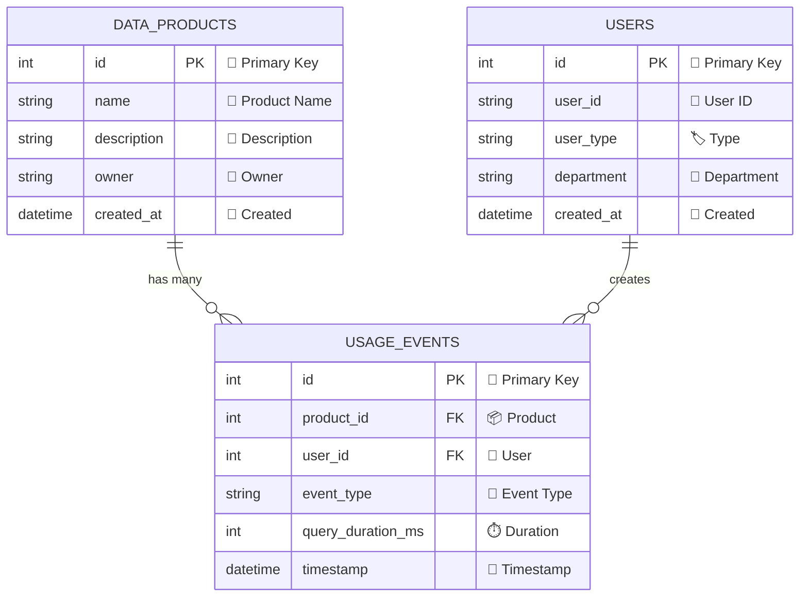
```mermaid
erDiagram
    DATA_PRODUCTS ||--o{ USAGE_EVENTS : "has many"
    USERS ||--o{ USAGE_EVENTS : "creates"

    DATA_PRODUCTS {
        int id PK "🔑 Primary Key"
        string name "📛 Product Name"
        string description "📝 Description"
        string owner "👤 Owner"
        datetime created_at "📅 Created"
    }

    USERS {
        int id PK "🔑 Primary Key"
        string user_id "👤 User ID"
        string user_type "🏷️ Type"
        string department "🏢 Department"
        datetime created_at "📅 Created"
    }

    USAGE_EVENTS {
        int id PK "🔑 Primary Key"
        int product_id FK "📦 Product"
        int user_id FK "👤 User"
        string event_type "🎯 Event Type"
        int query_duration_ms "⏱️ Duration"
        datetime timestamp "📅 Timestamp"
    }
```

---

### 4. AI Layer

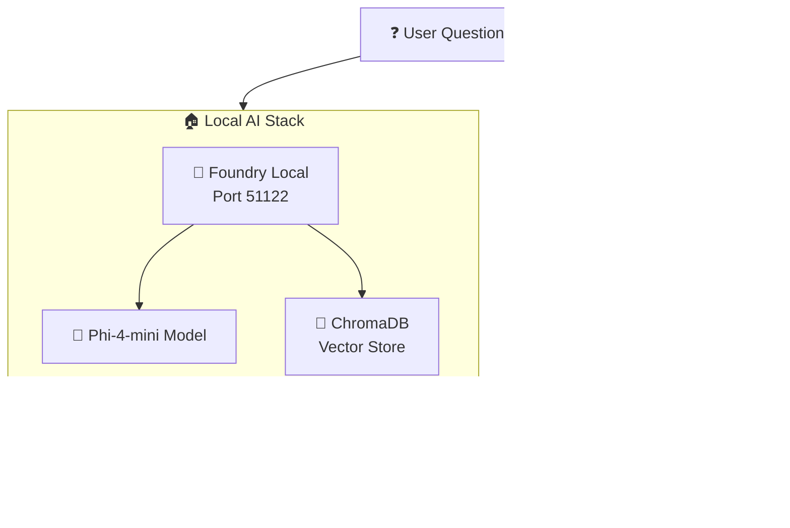
```mermaid
flowchart TB
    subgraph Local["🏠 Local AI Stack"]
        direction TB
        F["🤖 Foundry Local<br/>Port 51122"]
        P["🧠 Phi-4-mini Model"]
        C["💾 ChromaDB<br/>Vector Store"]
        F --> P
        F --> C
    end

    subgraph Cloud["☁️ Cloud AI Stack"]
        direction TB
        G["⚡ Groq API"]
        L["🦙 Llama 3.3 70B"]
        G --> L
    end

    Q["❓ User Question"] --> Local
    Q --> Cloud
    Local --> A["💬 AI Response"]
    Cloud --> A
```

---

## Data Flow

### Dashboard Loading Flow

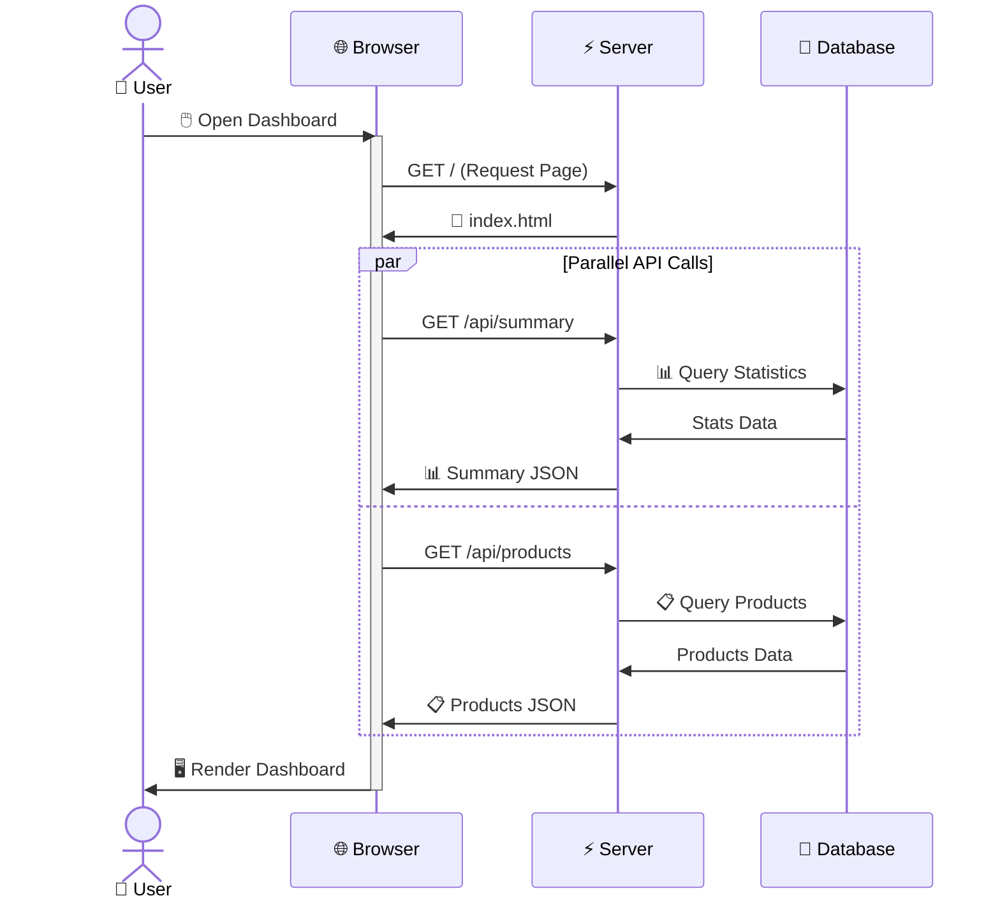
```mermaid
sequenceDiagram
    actor U as 👤 User
    participant B as 🌐 Browser
    participant S as ⚡ Server
    participant DB as 💾 Database

    U->>B: 🖱️ Open Dashboard
    activate B

    B->>S: GET / (Request Page)
    S->>B: 📄 index.html

    par Parallel API Calls
        B->>S: GET /api/summary
        S->>DB: 📊 Query Statistics
        DB->>S: Stats Data
        S->>B: 📊 Summary JSON
    and
        B->>S: GET /api/products
        S->>DB: 📋 Query Products
        DB->>S: Products Data
        S->>B: 📋 Products JSON
    end

    B->>U: 🖥️ Render Dashboard
    deactivate B
```

### AI Chat Flow

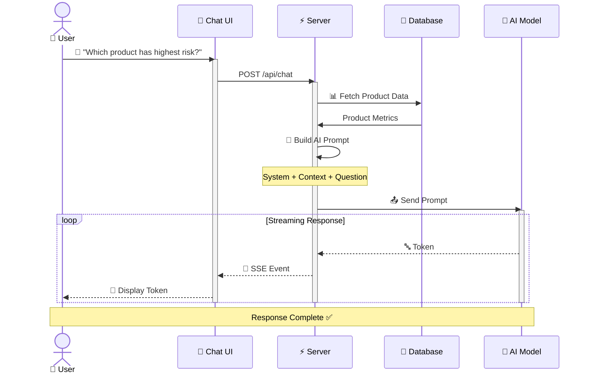
```mermaid
sequenceDiagram
    actor U as 👤 User
    participant C as 💬 Chat UI
    participant S as ⚡ Server
    participant DB as 💾 Database
    participant AI as 🤖 AI Model

    U->>C: 💭 "Which product has highest risk?"
    activate C

    C->>S: POST /api/chat
    activate S

    S->>DB: 📊 Fetch Product Data
    DB->>S: Product Metrics

    S->>S: 🔨 Build AI Prompt
    Note over S: System + Context + Question

    S->>AI: 📤 Send Prompt
    activate AI

    loop Streaming Response
        AI-->>S: 🔤 Token
        S-->>C: 📡 SSE Event
        C-->>U: 💬 Display Token
    end

    deactivate AI
    deactivate S
    deactivate C

    Note over U,AI: Response Complete ✅
```

---

## Key Features Explained

### Feature Overview

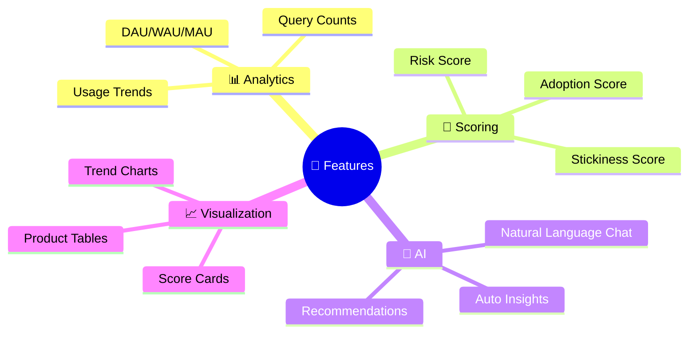
```mermaid
mindmap
  root((🎯 Features))
    📊 Analytics
      DAU/WAU/MAU
      Query Counts
      Usage Trends
    🎯 Scoring
      Adoption Score
      Stickiness Score
      Risk Score
    🤖 AI
      Natural Language Chat
      Auto Insights
      Recommendations
    📈 Visualization
      Trend Charts
      Score Cards
      Product Tables
```

### Adoption Score Calculation

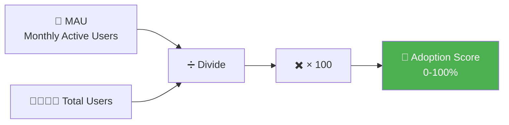
```mermaid
graph LR
    A["👥 MAU<br/>Monthly Active Users"] --> C["➗ Divide"]
    B["👨‍👩‍👧‍👦 Total Users"] --> C
    C --> D["✖️ × 100"]
    D --> E["🎯 Adoption Score<br/>0-100%"]

    style E fill:#4caf50,color:#fff
```

### Stickiness Score Calculation

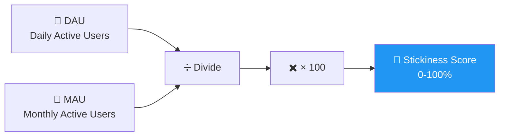
```mermaid
graph LR
    A["👤 DAU<br/>Daily Active Users"] --> C["➗ Divide"]
    B["👥 MAU<br/>Monthly Active Users"] --> C
    C --> D["✖️ × 100"]
    D --> E["🔄 Stickiness Score<br/>0-100%"]

    style E fill:#2196f3,color:#fff
```

### Risk Assessment

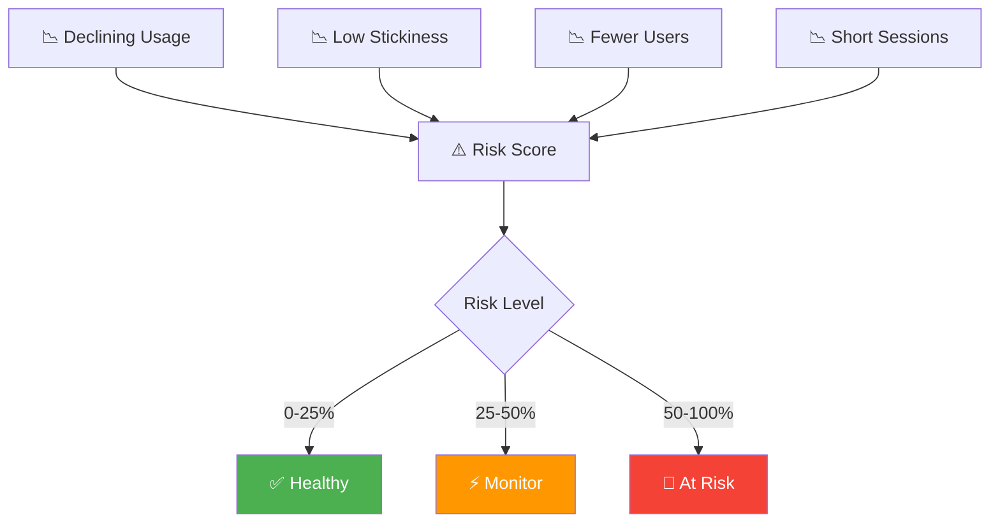
```mermaid
graph TD
    A["📉 Declining Usage"] --> E["⚠️ Risk Score"]
    B["📉 Low Stickiness"] --> E
    C["📉 Fewer Users"] --> E
    D["📉 Short Sessions"] --> E

    E --> F{"Risk Level"}
    F -->|0-25%| G["✅ Healthy"]
    F -->|25-50%| H["⚡ Monitor"]
    F -->|50-100%| I["🚨 At Risk"]

    style G fill:#4caf50,color:#fff
    style H fill:#ff9800,color:#fff
    style I fill:#f44336,color:#fff
```

---

## Technology Stack

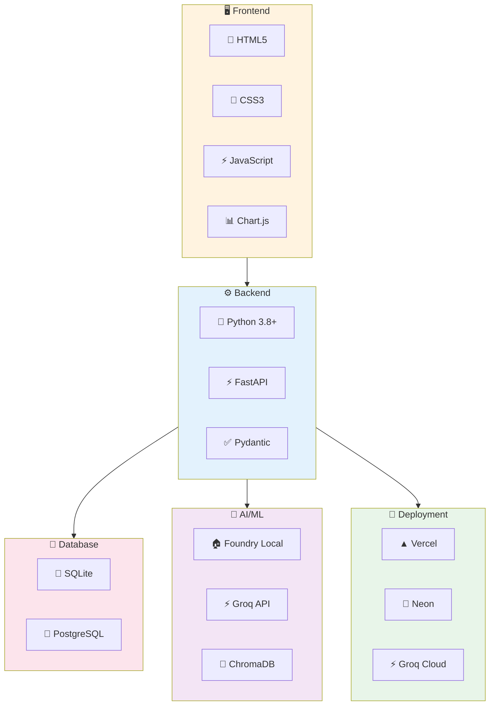
```mermaid
graph TB
    subgraph Frontend["🖥️ Frontend"]
        HTML["📄 HTML5"]
        CSS["🎨 CSS3"]
        JS["⚡ JavaScript"]
        Chart["📊 Chart.js"]
    end

    subgraph Backend["⚙️ Backend"]
        Python["🐍 Python 3.8+"]
        FastAPI["⚡ FastAPI"]
        Pydantic["✅ Pydantic"]
    end

    subgraph Database["💾 Database"]
        SQLite["📁 SQLite"]
        Postgres["🐘 PostgreSQL"]
    end

    subgraph AI["🤖 AI/ML"]
        Foundry["🏠 Foundry Local"]
        Groq["⚡ Groq API"]
        Chroma["🧠 ChromaDB"]
    end

    subgraph Deploy["🚀 Deployment"]
        Vercel["▲ Vercel"]
        Neon["🐘 Neon"]
        GroqCloud["⚡ Groq Cloud"]
    end

    Frontend --> Backend
    Backend --> Database
    Backend --> AI
    Backend --> Deploy

    style Frontend fill:#fff3e0
    style Backend fill:#e3f2fd
    style Database fill:#fce4ec
    style AI fill:#f3e5f5
    style Deploy fill:#e8f5e9
```

### Tech Stack Summary

| Layer | Technology | Purpose |
|-------|------------|---------|
| 🖥️ Frontend | HTML/CSS/JS + Chart.js | User Interface |
| ⚙️ Backend | Python + FastAPI | API Server |
| 💾 Database | SQLite / PostgreSQL | Data Storage |
| 🤖 AI | Foundry / Groq | Intelligence |
| 🚀 Deploy | Vercel + Neon | Hosting |

---

## How the AI Chat Works

### AI Pipeline

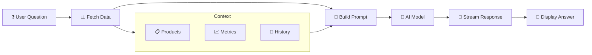
```mermaid
flowchart LR
    A["❓ User Question"] --> B["📊 Fetch Data"]
    B --> C["🔨 Build Prompt"]
    C --> D["🤖 AI Model"]
    D --> E["📡 Stream Response"]
    E --> F["💬 Display Answer"]

    subgraph Context
        B1["📋 Products"]
        B2["📈 Metrics"]
        B3["📝 History"]
    end

    B --> Context
    Context --> C
```

### Prompt Structure

```mermaid
graph TD
    subgraph "📝 Prompt Components"
        A["🎭 System Role<br/>'You are a data analyst...'"]
        B["📊 Data Context<br/>Product metrics JSON"]
        C["❓ User Question<br/>'Which product is at risk?'"]
    end

    A --> D["📤 Combined Prompt"]
    B --> D
    C --> D
    D --> E["🤖 AI Model"]
    E --> F["💬 Response"]
```

---

## API Reference

### Endpoint Map

```mermaid
graph LR
    subgraph "📖 Read Endpoints"
        A["GET /"] --> A1["📄 Dashboard"]
        B["GET /api/health"] --> B1["✅ Health Check"]
        C["GET /api/summary"] --> C1["📊 Statistics"]
        D["GET /api/products"] --> D1["📋 All Products"]
        E["GET /api/products/:id"] --> E1["📦 Single Product"]
    end

    subgraph "✏️ Write Endpoints"
        F["POST /api/chat"] --> F1["💬 AI Chat"]
        G["POST /api/insights"] --> G1["💡 AI Insights"]
        H["POST /api/track"] --> H1["📝 Track Event"]
    end
```

### API Response Flow

```mermaid
sequenceDiagram
    participant C as 🖥️ Client
    participant S as ⚡ Server
    participant D as 💾 Database

    Note over C,D: GET /api/products

    C->>S: 📤 Request
    S->>D: 🔍 Query
    D->>S: 📊 Data
    S->>S: 🔨 Calculate Scores
    S->>C: 📥 JSON Response

    Note over C,S: Response Example
    Note right of C: [{<br/>"id": 1,<br/>"name": "Customer 360",<br/>"adoption_score": 100,<br/>"abandonment_risk": 0<br/>}]
```

---

## Setup Guide

### Setup Decision Tree

```mermaid
flowchart TD
    A["🚀 Start"] --> B{"Just want to try it?"}
    B -->|Yes| C["🌐 Visit Live Demo<br/>data-product-analytics.vercel.app"]
    B -->|No| D{"Want to develop locally?"}
    D -->|Yes| E["🏠 Local Setup"]
    D -->|No| F["☁️ Deploy to Vercel"]

    E --> E1["1. Clone Repo"]
    E1 --> E2["2. pip install"]
    E2 --> E3["3. Start Foundry"]
    E3 --> E4["4. python app.py"]

    F --> F1["1. Get Groq Key"]
    F1 --> F2["2. Create Neon DB"]
    F2 --> F3["3. Deploy on Vercel"]
    F3 --> F4["4. Add Env Vars"]

    style C fill:#4caf50,color:#fff
    style E4 fill:#2196f3,color:#fff
    style F4 fill:#9c27b0,color:#fff
```

### Local Setup Steps

```mermaid
graph LR
    A["📥 Clone"] --> B["🐍 Venv"]
    B --> C["📦 Install"]
    C --> D["🤖 Start AI"]
    D --> E["🚀 Run App"]
    E --> F["✅ Done!"]

    style F fill:#4caf50,color:#fff
```

### Cloud Deployment Steps

```mermaid
graph LR
    A["🔑 Get Keys"] --> B["🐘 Create DB"]
    B --> C["▲ Deploy"]
    C --> D["⚙️ Set Vars"]
    D --> E["✅ Live!"]

    style E fill:#4caf50,color:#fff
```

---

## Troubleshooting

### Issue Decision Tree

```mermaid
flowchart TD
    A["❌ Issue"] --> B{"Where?"}

    B -->|Local| C{"What error?"}
    B -->|Vercel| D{"What error?"}

    C -->|AI not responding| C1["🔧 Start Foundry Local"]
    C -->|DLL load failed| C2["📦 Install VC++ Redistributable"]
    C -->|Port in use| C3["🔄 Kill process or change port"]

    D -->|Database error| D1["🔧 Check DATABASE_URL"]
    D -->|AI error| D2["🔑 Check GROQ_API_KEY"]
    D -->|500 Error| D3["📋 Check Vercel Logs"]

    style C1 fill:#4caf50,color:#fff
    style C2 fill:#4caf50,color:#fff
    style C3 fill:#4caf50,color:#fff
    style D1 fill:#4caf50,color:#fff
    style D2 fill:#4caf50,color:#fff
    style D3 fill:#4caf50,color:#fff
```

---

## Summary

```mermaid
graph LR
    A["📊 Data"] --> B["🤖 AI"]
    B --> C["💡 Insights"]

    style A fill:#2196f3,color:#fff
    style B fill:#9c27b0,color:#fff
    style C fill:#4caf50,color:#fff
```

This platform provides:

| # | Feature | Description |
|---|---------|-------------|
| 1 | 👁️ **Visibility** | See how all your data products are being used |
| 2 | 🧠 **Intelligence** | AI analyzes patterns and provides recommendations |
| 3 | 🔄 **Flexibility** | Run locally or deploy to cloud for free |
| 4 | ✨ **Simplicity** | Clean dashboard, easy setup |

### Quick Links

```mermaid
graph LR
    A["🌐 Live Demo"] --> B["data-product-analytics.vercel.app"]
    C["📂 Repository"] --> D["github.com/pandeyraunak007/data-product-analytics"]

    click B "https://data-product-analytics.vercel.app"
    click D "https://github.com/pandeyraunak007/data-product-analytics"
```

---

*Last updated: December 2024*
*Repository: https://github.com/pandeyraunak007/data-product-analytics*
*Live Demo: https://data-product-analytics.vercel.app*
